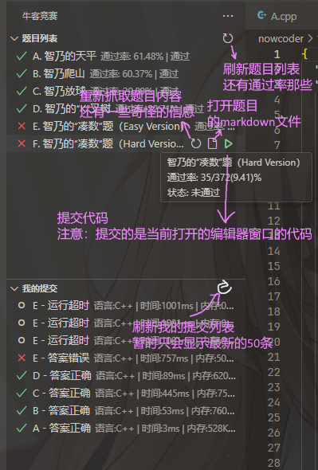

# NowcoderAC for Visual Studio Code

你甚至可以在vsc里看题，做题，交题

> [!WARNING]  
> 此插件处于刚刚开发阶段，还存在巨量的bug以及非人类的操作逻辑  
> 可能发生的事情包括但不限于  
> 
>  - 把题面从html转换回markdown的时候炸了，导致漏掉了某些信息
>  - 被封号
>  - 弹出一些让人一脸懵逼的报错
>  - 不小心把B题的代码交到A去了

## 功能

 - [x] 看题
 - [x] 交题
 - [x] 巨量的bug
 - [x] 和cph联动
 - [x] 看榜
 - [x] 赛时计时器
 - [ ] 弹出赛时公告
 - [ ] 交题快捷键

## 使用教程

 1. 安装扩展
 2. 打开命令面板搜索 `创建比赛工作空间`
 3. 输入比赛id（例如 `https://ac.nowcoder.com/acm/contest/106509` 的比赛id是 `106509`）
 4. 选择比赛代码文件夹的位置（如果选择 `./nowcoder` 作为目录，则会创建比赛文件夹在 `./nowcoder/106509`，题目文件都会在里面）
 5. 这个时候应该会叫你登录，选择allow，之后会弹出一个输入框
 6. 打开浏览器，进入 `https://ac.nowcoder.com` 牛客竞赛官网，**登录之后**按下`F12`，打开开发者工具，
 7. 点击弹出的窗口中toolbox中的`console`，粘贴以下命令 `document.cookie.split('; ').find(row => row.startsWith('t=')).split('=')[1];` （如果粘贴的时候弹出一个黄色的警告不让你粘贴你就手动输入 `allow pasting` 回车之后再粘贴）
 8. 之后会返回一串字符串，复制他(补药复制引号)，回到vsc，粘贴到弹出来的输入框里，按回车
 9. 在左侧activityBar里找到牛客竞赛，点进去之后就是这场比赛的题目和你的提交记录了(∠・ω< )⌒☆

## 界面介绍

